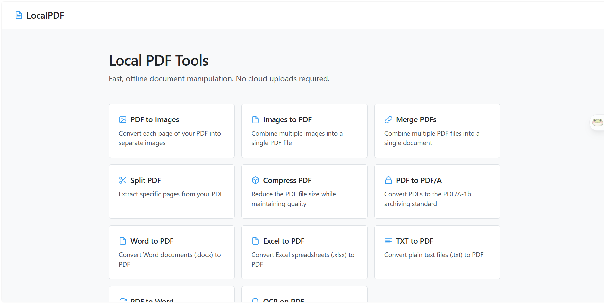

<div align="center">

# 🌟 LocalPDF - Modern UI Edition

[](https://opensource.org/licenses/MIT)
[](https://www.python.org/)
[](https://flask.palletsprojects.com/)
[](https://www.docker.com/)

> Every PDF tool you need — 100% local, 100% private, with a sleek, high-density modern interface.

[Features](#-features) •
[Usage](#-usage) •
[Tech Stack](#-tech-stack) •
[License](#-license)

---



</div>

## 📋 What is it?

LocalPDF is a self-hosted web app for PDF and document manipulation. Every file is processed on your own machine — nothing is uploaded to any server.

This updated edition features a completely overhauled, high-density, professional UI designed specifically for students, academics, and researchers who need fast, offline document manipulation. Furthermore, dependencies have been updated to support the latest Python versions up to **Python 3.14**.

No accounts. No cloud. No data leaving your computer.

## ✨ Features

### 📤 Convert from PDF
- **🖼️ PDF → Images** — Extract each page as a PNG image
- **📝 PDF → Word** — Convert PDF into an editable DOCX document
- **📊 PDF → Excel** — Extract tables into an XLSX spreadsheet
- **📄 PDF → Text** — Extract all text into a TXT file
- **🔒 PDF → PDF/A** — Convert to archival standard (PDF/A-1b)
- **🔍 OCR on PDF** — Extract text from scanned PDFs and images with Tesseract OCR

### 📥 Convert to PDF
- **📄 Images → PDF** — Combine multiple images into a single PDF
- **📝 Word → PDF** — Convert one or more DOCX documents to PDF
- **📊 Excel → PDF** — Convert XLSX spreadsheets to PDF
- **📄 TXT → PDF** — Convert plain text files to PDF

### 🔄 Manipulate PDF
- **🔗 Merge PDFs** — Combine multiple PDFs into one document
- **✂️ Split PDF** — Extract specific pages into individual files
- **📦 Compress PDF** — Reduce file size while preserving quality

## 🚀 Usage

### With Docker (Recommended)

#### Pull and run (fastest)

```bash
docker run -p 5000:5000 ghcr.io/virgiliojr94/localpdf.io:latest
```

#### Build locally

```bash
git clone https://github.com/MohammedBACHIRIx/Modern-UI-localpdf.git
cd Modern-UI-localpdf
docker build -t localpdf .
docker run -p 5000:5000 localpdf
```

Open: **http://localhost:5000**

### Without Docker (Windows/Linux/Mac)

```bash
git clone https://github.com/MohammedBACHIRIx/Modern-UI-localpdf.git
cd Modern-UI-localpdf

# Create virtual environment
python -m venv venv
# Windows
.\venv\Scripts\activate
# Linux/Mac
source venv/bin/activate

pip install -r requirements.txt

# Start the server
python app.py
```

*Note: Some features like PDF/A conversion and OCR require Ghostscript and Tesseract installed on your system respectively. The app now gracefully handles missing dependencies if you don't need those specific features.*

Open: **http://localhost:5000**

## 🛠️ Tech stack

- **Flask** - Web Framework
- **PyMuPDF** - PDF manipulation (updated for Python 3.14 support)
- **Pillow** - Image processing
- **python-docx** - Word manipulation
- **ReportLab** - PDF Generation
- **OpenPyXL** - Excel manipulation
- **pdf2docx** - PDF to DOCX converter
- **Tesseract OCR** - Optical Character Recognition

## 🔒 Privacy

All files are processed **locally** on your machine. No data is sent to external servers — ever.

## 📝 License

MIT License — free to use and modify.

---

⭐ If this project was useful to you, consider giving it a star on GitHub!
